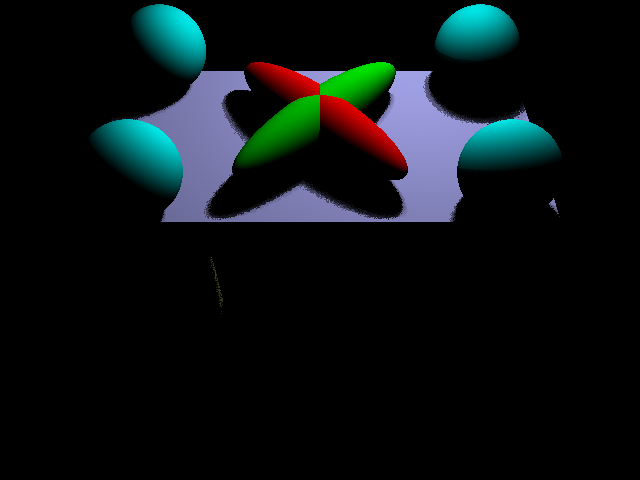
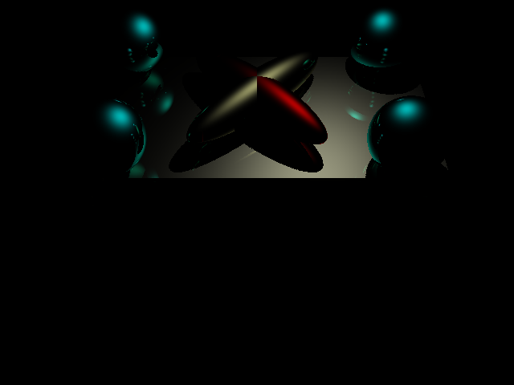

# CSE 167 Raytracer HW4
This webpage is to demonstrate the extra credit portions for HW4.

This link shows I completed the original assignment.
https://raviucsdgroup.s3.amazonaws.com/hw3/3aefa8fdac1b22ab5e3019fc8d80a4da/20220316075214/index.html

## Soft Shadows
Using the technique described by the professor in lecture I achieved a softer shadow using random jittering and having a grid of point lights. I used this on the diffuse scene and got this result.

## Transmission lighting
I used these slides http://graphics.cs.cmu.edu/courses/15-468/lectures/lecture3.pdf to add basic transmission lighting. I used it on the specular scene with vacuum to diamond transmission ratio and got the following.

You can see the color of the tabletop coming through the originally green ellipsoid (of which I turned off the specular component) to a slightly golden color.
