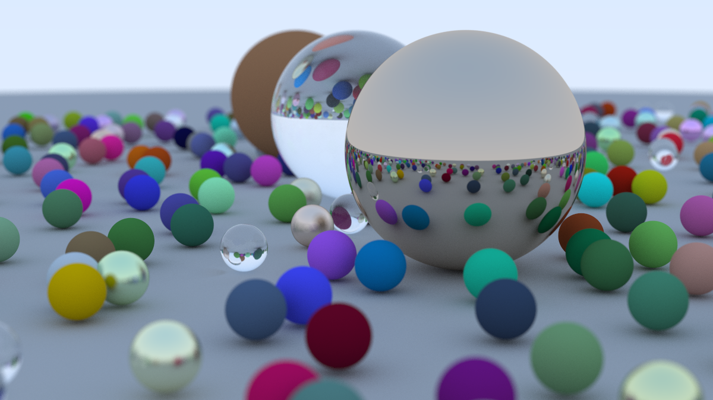

# Ray Tracing in One Weekend Series
Here is my code as I follow the Ray Tracing in One Weekend Series.
## One Weekend
Compile
```
g++ -o main ./main.cpp
```
Render
```
./main > ./renders/final.ppm
cd ./renders
magick mogrify -path ../png_renders/ -format png *.ppm
```
Result
